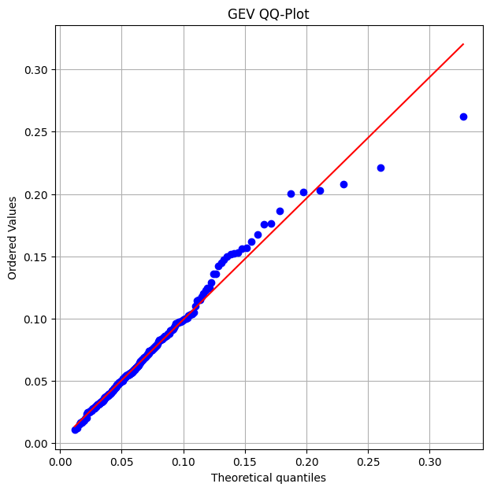
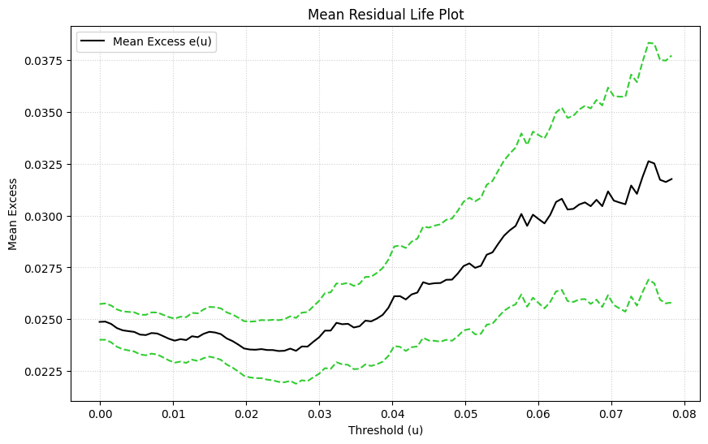
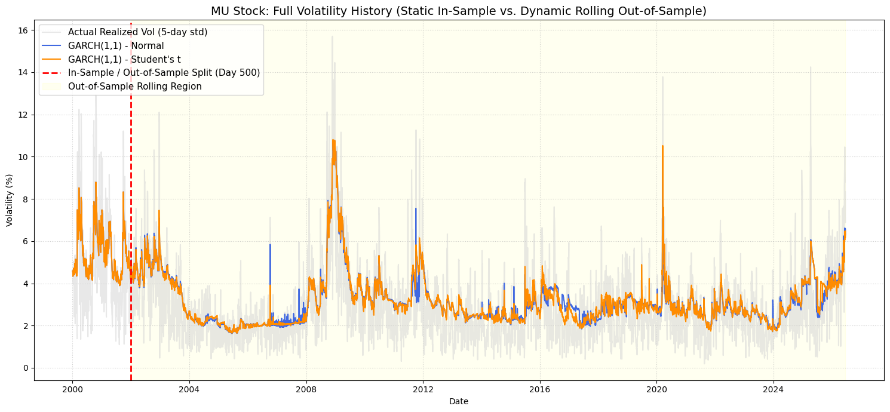
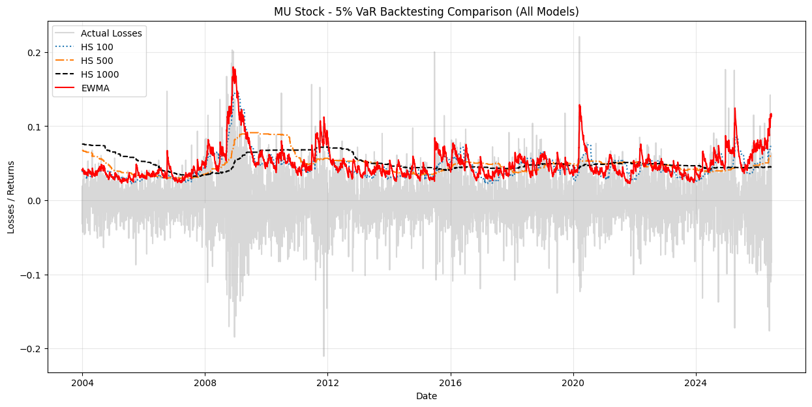
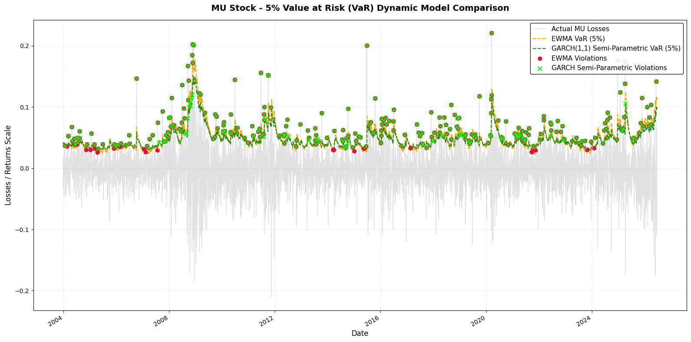

# MU Stock Extreme Risk Modeling & Dynamic VaR Backtesting

This repository provides an advanced quantitative risk management framework applied to **Micron Technology, Inc. (MU)** log-returns. The project evaluates tail risk using Extreme Value Theory (EVT), implements conditional volatility models (GARCH Family & EWMA), and rigorously tests daily 5% Value at Risk (VaR) predictive performance through parametric, non-parametric, and semi-parametric backtesting suites.

---

## 1. Extreme Value Theory (EVT) & Tail Risk Analysis
To model the behavior of catastrophic market drops on MU stock, we implemented two foundational approaches from Extreme Value Theory:

* **Block Maxima Approach (GEV):** We partitioned the historical data into monthly blocks to capture absolute worst-case losses. The Generalized Extreme Value distribution was fitted, and the adequacy of the shape parameter ($c$) was validated by analyzing standardized crude residuals against a theoretical Exponential(1) distribution.
* **Peaks-Over-Threshold Approach (POT):** We used the *Mean Residual Life Plot* to visually determine an optimal threshold ($u = 0.04$). Beyond this boundary, extreme excesses were modeled using a Generalized Pareto Distribution (GPD) to calculate tail-specific VaR and Expected Shortfall (ES).

  
  

  

---

## 2. Volatility Forecasting: In-Sample vs. Rolling Out-of-Sample
Asset returns exhibit severe volatility clustering. After diagnostic checks via ACF/PACF plots of squared returns, we estimated multiple conditional variance specifications. 

To challenge the models under realistic trading conditions, we set up a **500-day rolling Out-of-Sample (OOS) forecasting window**. We compared a Gaussian GARCH(1,1) against a Student's t GARCH(1,1) to analyze how capturing heavy-tailed error distributions impacts predictive accuracy (evaluated through MAE, RMSE, and OOS $R^2$).

  

---

## 3. Value at Risk (VaR) Models & Backtesting Evaluation
We extracted daily 5% VaR forecasts utilizing three distinct methodological philosophies:
1. **Non-Parametric (Historical Simulation):** Rolling windows of 100, 500, and 1000 days.
2. **Parametric (EWMA):** RiskMetrics approach with a localized decay factor ($\lambda = 0.94$).
3. **Semi-Parametric (Filtered GARCH):** Leveraging the GARCH(1,1) conditional volatility proxy combined with the empirical quantile of the model's standardized residuals.

### Historical Simulation Performance Comparison
The standard backtesting suite evaluates the traditional tradeoff between window length and adaptability. Long windows (HS 1000) capture accurate unconditional counts but fail independence tests due to severe exception clustering during market crises.

  

---

## 4. Advanced Comparative Diagnostics: EWMA vs. GARCH Semi-Parametric
We subjected our top-performing dynamic models—the parametric EWMA and the Semi-Parametric GARCH—to a strict validation battery. This included the **Kupiec Test** (Unconditional Coverage), the **Christoffersen Test** (Independence), a **Joint Likelihood Ratio**, and the **Manganelli-Engle Linear Regression F-Test** ($H_0: \beta_0 = \beta_1 = 0$ on shifted violations $\eta_t$).

### Statistical Summary
* Both models successfully passed all conditional coverage criteria ($p\text{-values} > 0.05$).
* **EWMA achieved superior independence scores** (Regression F p-value: `0.7468` vs GARCH: `0.3978`). This proves that a highly reactive, locally-weighted parameter is marginally more efficient at neutralizing the volatility clustering of tech equities like MU compared to static, full-sample GARCH filters.

  

